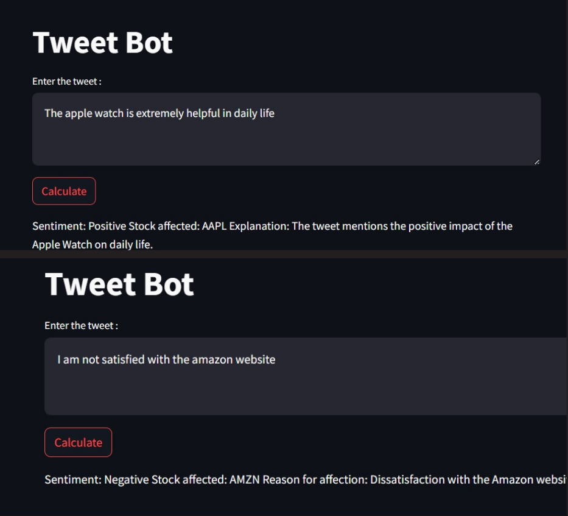

# Sentiment Analysis of Twitter Data for Predicting Stock Market Movements

## Overview
This project analyzes Twitter data related to specific stocks or the stock market using NLP and ML. It aims to explore correlations between public sentiment and stock market movements, leveraging real-time public opinions for predictive modeling.

## Project Pipeline
1. **Data Collection**
   - Source: [Kaggle Dataset](https://www.kaggle.com/code/saadusama/twitter-s-impact-on-stock-market-prices/input)
   - Collect tweets and financial data.

2. **Data Preprocessing**
   - Techniques: Handle null values, lowercase conversion, punctuation removal, tokenization, stop-word removal, stemming, lemmatization, and emoji removal.

3. **Sentiment Analysis**
   - Tool: VADER Sentiment Analysis
   - Outputs sentiment as Neutral, Negative, or Positive.

4. **Feature Extraction**
   - Techniques: Bag of Words, CBOW, Skipgram, Word2Vec, TF-IDF, GloVe, and BERT.

5. **Model Building**
   - Models: Decision Tree, Random Forest, Logistic Regression, KNN, SVM, Naive Bayes, and All-MiniLM-L6-v2.

6. **Evaluation**
   - Metrics: Accuracy, Precision, F1 Score.

## Key Techniques and Models
- **Embedding Techniques:**
  - BERT: Excels in context understanding, ideal for Twitter's short texts.
  - TF-IDF: Highlights unique words effectively for sentiment analysis.

- **Advanced Model:**
  - All-MiniLM-L6-v2: Provides sentence embeddings and uses a vector database for efficient tweet retrieval and sentiment analysis.

## Results

## Future Scope
1. **Model Enhancement:** Explore advanced NLP models like GPT-3 and Transformer-XL.
2. **Real-Time Analysis:** Develop pipelines for real-time sentiment analysis and deploy models as scalable cloud services.

## Contributors
- Arun Kumar M ([GitHub](https://github.com/ArunKumar0047))
- Bagiya Lakshmi ([GitHub](https://github.com/bagiyalakshmi))

